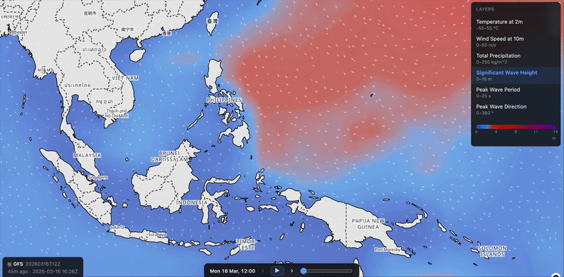

# Weatherman

**Maritime weather visualization & decision support platform** — interactive weather layers with AIS vessel tracking and weather routing.

<table>
  <tr>
    <td align="center">
      <br>
      <em>Wind particle flow</em>
    </td>
    <td align="center">
      <br>
      <em>Wave animation</em>
    </td>
  </tr>
</table>

## What it does

- **Weather visualization** — real-time meteorological layers (wind, waves, pressure, precipitation) rendered as WebGL overlays on a slippy map
- **Wind & wave particles** — GPU-accelerated particle systems showing flow direction and intensity, with smooth temporal interpolation
- **AIS vessel tracking** — live vessel positions via AIS feed, with filtering by vessel type, flag, and cargo
- **Weather routing** — isochrone-based optimal route calculation accounting for weather, currents, and vessel characteristics
- **Temporal animation** — scrub through forecast timesteps with animated transitions between frames

## Tech stack

| Layer | Technologies |
|-------|-------------|
| **Backend** | Python · FastAPI · Zarr · DuckDB (spatial) · Argo Workflows |
| **Frontend** | React · TypeScript · MapLibre GL JS · WebGL · Vite |
| **Infra** | Docker · TiTiler · S3-compatible storage · OpenTelemetry |

## Quick start

```bash
docker compose up
```

Copy `.env.example` to `.env` and configure S3 credentials and data paths before starting.

## Development

**Backend**

```bash
uv run pytest                         # run tests
uv run python -m weatherman.main      # start API server
```

**Frontend**

```bash
cd frontend
npm install
```

> **Note:** System Node is v14 (too old). Use the nvm-managed v22 by prefixing commands:
> ```bash
> PATH="/Users/admin/.nvm/versions/node/v22.18.0/bin:/usr/bin:/bin" ./node_modules/.bin/vite dev
> ```

## Architecture

```
GRIB2 → Zarr (canonical) → COG (map-optimized) → TiTiler (dynamic tiles) → MapLibre + WebGL particles
                                                                          ↗
                                          AIS feed → DuckDB (spatial) ──┘
```

Ingest pipelines convert raw GRIB2 forecasts into Zarr archives (canonical store), then project to COGs for map tiling. TiTiler serves tiles dynamically — no pre-rendered pyramids. The frontend composites raster tiles with WebGL particle overlays. AIS data is stored in DuckDB with the spatial extension for fast geospatial queries.

## API standards

Exposes **OGC API Tiles**, **EDR**, and **Features** endpoints, with a **STAC** catalog for dataset discovery.
