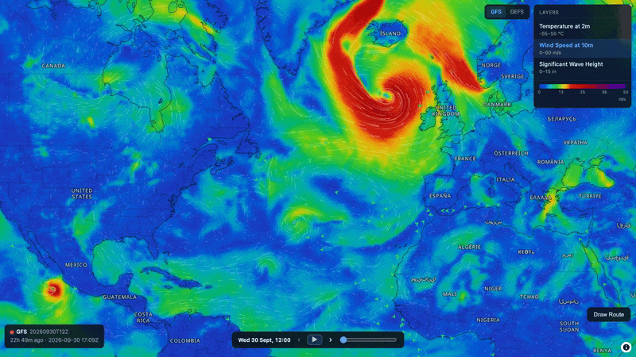
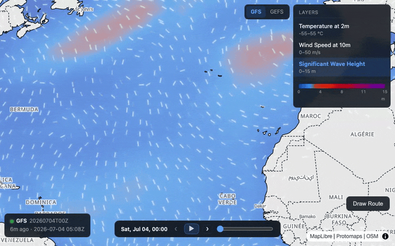
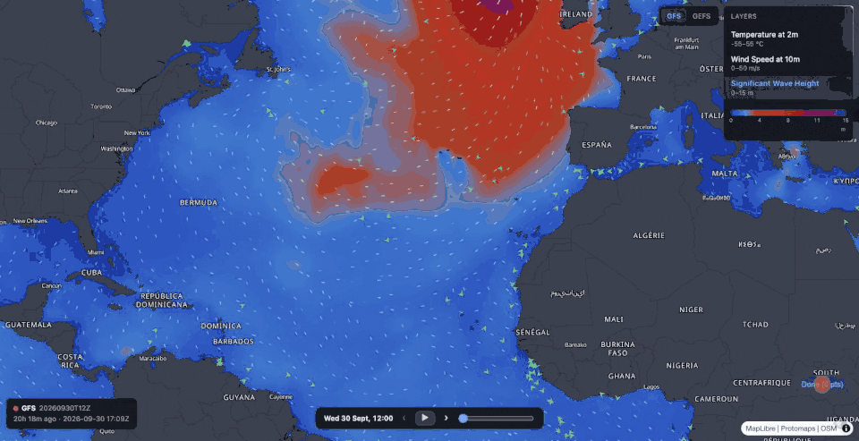
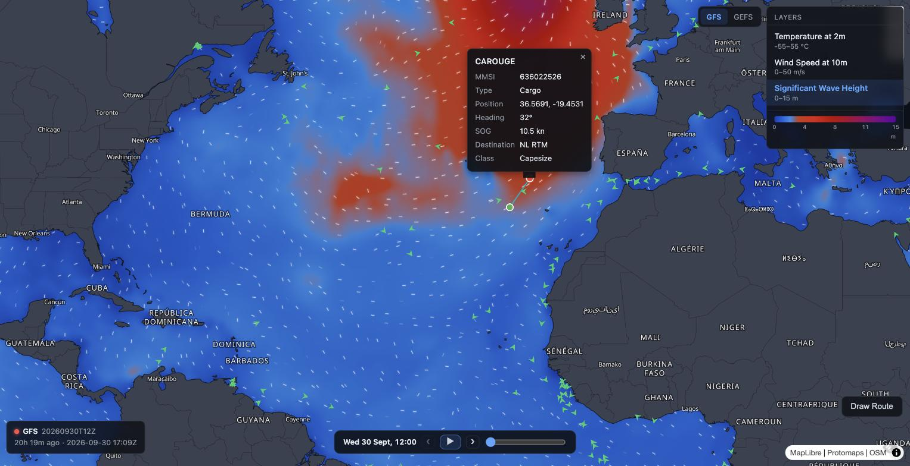
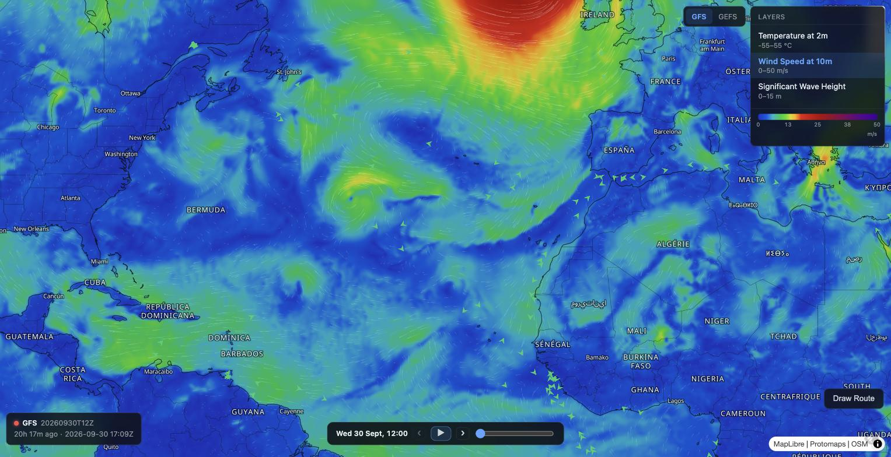

# Weatherman 🌊 🌬️ 🚢

**Windy-style marine weather maps with live AIS vessels and along-route forecasts**

GFS and GEFS forecasts, rendered on the GPU over a vector basemap, with the ships underneath.


*GPU wind particles over the wind-speed field, scrubbing through forecast hours*

## Features

- **Weather layers** — temperature, 10 m wind speed and significant wave height, drawn as WebGL rasters with smooth blending between forecast hours.
- **Wind & wave particles** — GPU particle systems trace wind flow and swell direction across the whole map.
- **GFS and GEFS** — switch between the deterministic run and the ensemble mean; a freshness badge shows which cycle you're looking at and how old it is.
- **Voyage corridor** — draw a route and get a distance × forecast-hour profile of waves, wind or temperature along it.
- **AIS vessels** — vessel positions as vector tiles, with a popup for MMSI, type, speed, destination and recent track.
- **Point readout** — hover anywhere to read every variable at that position and time.
- **Live updates** — new forecast runs and AIS refreshes are pushed to the browser over SSE, with no polling.

<table>
  <tr>
    <td width="50%"><br><em>Wave height with animated swell direction</em></td>
    <td width="50%"><br><em>Voyage corridor: wave height along a transatlantic route</em></td>
  </tr>
  <tr>
    <td width="50%"><br><em>AIS vessel details and recent track</em></td>
    <td width="50%"><br><em>Wind speed with live vessel positions</em></td>
  </tr>
</table>

## Quickstart

**Local (no Docker):** needs [uv](https://docs.astral.sh/uv/) and Node ≥ 20.

```bash
(cd frontend && npm install)   # once
./scripts/dev.sh               # TiTiler :8080, API :8000, Vite :5173
```

The first run pulls a sample from NOAA: the latest GFS cycle, forecast hours 0, 3 and 6 (about 3 minutes and 2 GB). Later runs start in seconds. Open the URL Vite prints, usually <http://127.0.0.1:5173>.

```bash
SAMPLE_HOURS=0,3,6,9,12 ./scripts/dev.sh        # seed more hours on first run
NODE_BIN=~/.nvm/versions/node/v22.18.0/bin ./scripts/dev.sh   # if system node is too old
uv run python scripts/run_pipeline.py --hours 0,3,6 --max-runs 1 --tile-formats png   # refresh to the newest cycle
```

**Docker:**

```bash
cp .env.example .env
docker compose up
```

## Configuration

Weather works out of the box. Settings in `.env` are only needed for AIS:

| Variable | Default | Purpose |
|----------|---------|---------|
| `AIS_BACKEND` | `legacy_parquet` | `neptune` to ingest from the Neptune archive |
| `AIS_DB_PATH` | `/data/ais.duckdb` | DuckDB file holding vessel positions |
| `COMPOSE_PROFILES` | _(empty)_ | `ais-live` streams live AIS into the map (needs `NEPTUNE_LIVE_API_KEY`) |

See **[AIS / Neptune](docs/ais-neptune.md)** for ingest and live streaming.

## How it works

```
NOAA GRIB2 ─► Zarr (canonical) ─► COG ─► TiTiler ─► MapLibre + WebGL layers
                    │                                   ▲
                    └─► EDR point / trajectory queries ─┤
AIS feed ─► DuckDB (spatial) ─► vector tiles ───────────┘
```

Forecasts land in Zarr as the source of truth. Each run is staged, validated and only then published, so a run is never served half-written. COGs are a map-friendly projection of the Zarr data, tiled on demand by TiTiler; nothing is pre-rendered. The hover readout and voyage corridor read the Zarr data directly through **OGC API EDR** position and trajectory endpoints.

## Tech stack

| | |
|---|---|
| **Backend** | Python 3.14 · FastAPI · Zarr · TiTiler · DuckDB (spatial) |
| **Frontend** | React · TypeScript · MapLibre GL JS · WebGL2 · Vite · Protomaps |
| **Ops** | Docker Compose · OpenTelemetry · Grafana dashboards |

## Development

```bash
uv run pytest                          # backend tests
cd frontend
./node_modules/.bin/tsc -b --noEmit    # type-check
./node_modules/.bin/vite build         # production build
```

Design notes live in [docs/adr](docs/adr).

## License

[MIT](LICENSE)
